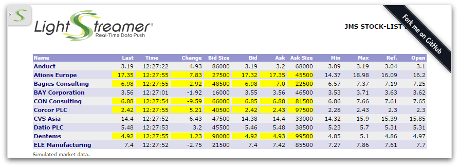

# Lightstreamer JMS Extender - Basic Stock-List Demo - HTML Client

This project contains a sample Web application that shows how the [_Lightstreamer JMS Extender JavaScript Client Library_](https://www.npmjs.com/package/lightstreamer-jms-web-client) can be used to connect to Lightstreamer JMS Extender.  
This projects is the JMS Extender version of the [Lightstreamer - Basic Stock-List Demo - HTML Client](https://github.com/Lightstreamer/Lightstreamer-example-StockList-client-javascript).




## Details

This demo displays real-time market data for 30 stocks, generated by the feed simulator included in the [Stock-List Demo Java Service](https://github.com/Lightstreamer/Lightstreamer-JMS-example-StockList-service-java). For simplicity, a single JMS topic is used for all stocks, while in a real scenario you would probably use a different JMS topic for each stock.

Check out the sources for further explanations.

## Install

Before you can run the demo of this project, some dependencies need to be solved:

* Note that, as prerequisite, the [Lightstreamer JMS Extender - Stock-List Demo - Java (JMS) Service](https://github.com/Lightstreamer/Lightstreamer-JMS-example-StockList-service-java) has to be deployed on your local Lightstreamer JMS Extender instance. Please check out that project and follow the installation instructions provided with it.
* Launch Lightstreamer JMS Extender.
* jQuery is currently hot-linked in the html page: you may want to replace it with a local version and/or to upgrade its version.
* [Lightstreamer visual widgets](https://demos.lightstreamer.com/commons/lightstreamer-widgets.js), such as  _Status Widget_ and _Dynagrid_, are hot-linked in the html page: they are in no way mandatory and you may replace them with widgets from any other library by modifying `grid.js` and the `onLSClient` event in `index.html`.
* As the latest version of the Lightstreamer JMS Extender JavaScript library is always available through [unpkg](https://unpkg.com/lightstreamer-jms-web-client), it is hot-linked in the html page.

Now, you need to configure the `src/js/app.js` of this example by specifying the name of the JMS connector you are going to use. By default, the demo will look for the **ActiveMQ** JMS connector, please refer to the related [Service project](https://github.com/Lightstreamer/Lightstreamer-JMS-example-StockList-service-java) for more details on the choice of a JMS broker to be used.

To set the JMS connector name and the connection name, look where the connection is created:

```js
  jms.TopicConnectionFactory.createTopicConnection("http://localhost:8080/", "ActiveMQ", null, null, {
```

To access the demo from a web browser, copy it somewhere under your root webserver directory. You can also add it to the JMS Extender internal web server pages under `<JMS_EXTENDER_HOME>/pages` directory by copying it there with a folder name such as `StockListDemo_JMS`. Subsequently you may access it as: [http://_your_jms_extender_http_address_/StockListDemo_JMS/](http://_your_jms_extender_http_address_/StockListDemo_JMS/).
Depending on the browser in use, and on the security settings, you might also be able to launch the index.html file directly from the file system.

## See Also

### JMS Extender Service Needed by This Demo Client

* [Lightstreamer JMS Extender - Stock-List Demo - Java (JMS) Service](https://github.com/Lightstreamer/Lightstreamer-JMS-example-StockList-service-java)

### Related Projects

* [Lightstreamer JMS Extender - Basic Stock-List Demo - Node.js Client](https://github.com/Lightstreamer/Lightstreamer-JMS-example-StockList-client-node)
* [Lightstreamer JMS Extender - Basic Chat Demo - HTML Client](https://github.com/Lightstreamer/Lightstreamer-JMS-example-Chat-client-javascript)
* [Lightstreamer JMS Extender - Basic Portfolio Demo - HTML Client](https://github.com/Lightstreamer/Lightstreamer-JMS-example-Portfolio-client-javascript)
* [Lightstreamer - Stock-List Demos - HTML Clients](https://github.com/Lightstreamer/Lightstreamer-example-StockList-client-javascript)

## Lightstreamer Compatibility Notes

* Compatible with Lightstreamer JMS Extender SDK for Web Clients since version 2.0.0 or newer.
* Compatible with Lightstreamer JMS Extender since version 2.0.0 or newer.
